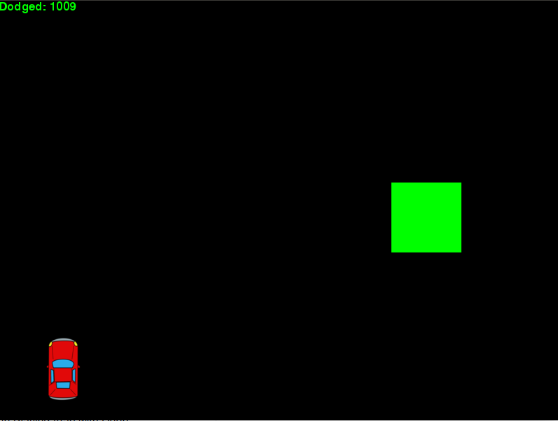

# Final Project: DQN-Car-Race



## Overview
This is the final project of GEE9022 (Cloud Computing and Big Data Analytics) in NCTU (National Chiao Tung University). This project demostrates a car race (object dodging) game with Deep-Q-Learning

## Installation Dependencies:
* Python 2.7
* TensorFlow 1.4
* pygame
* OpenCV-Python

## How to Run?
```
git clone https://github.com/albert100121/DQN_Car_Race.git
python deep_q_network.py
```

## How to Reproduce?
1. Comment out [these lines](https://github.com/albert100121/DQN_Car_Race/blob/master/deep_q_network.py#L27-L131)

2. Set `deep_q_network.py` paramters as follows
``` python
GAME = 'car'
ACTIONS = 3
GAMMA = 0.99
OBSERVE = 10000.
EXPLORE = 3000000.
FINAL_EPSILON = 0.0001
INITIAL_EPSILON = 1
REPLAY_MEMORY = 50000
BATCH = 32
FRAME_PER_ACTION = 1
```

## Disclaimer
This work is highly based on the following repos:

1. [yenchenlin/DeepLearningFlappyBird](https://github.com/yenchenlin/DeepLearningFlappyBird)
2. [pygame_car_race](https://github.com/naren-m/pygame_car_race)
